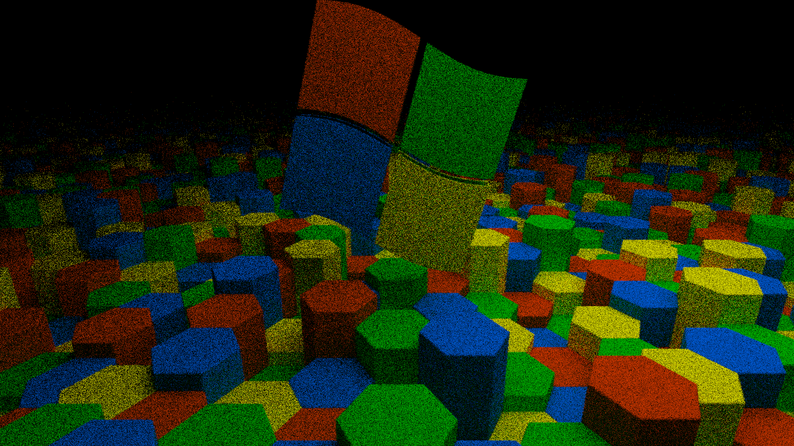

An example of a windows screensaver made with Direct3D.

# testing
to test the screensaver run `prog.scr -s`

# building
to build the program make sure you have run vcvarsall.bat and then run `make`

